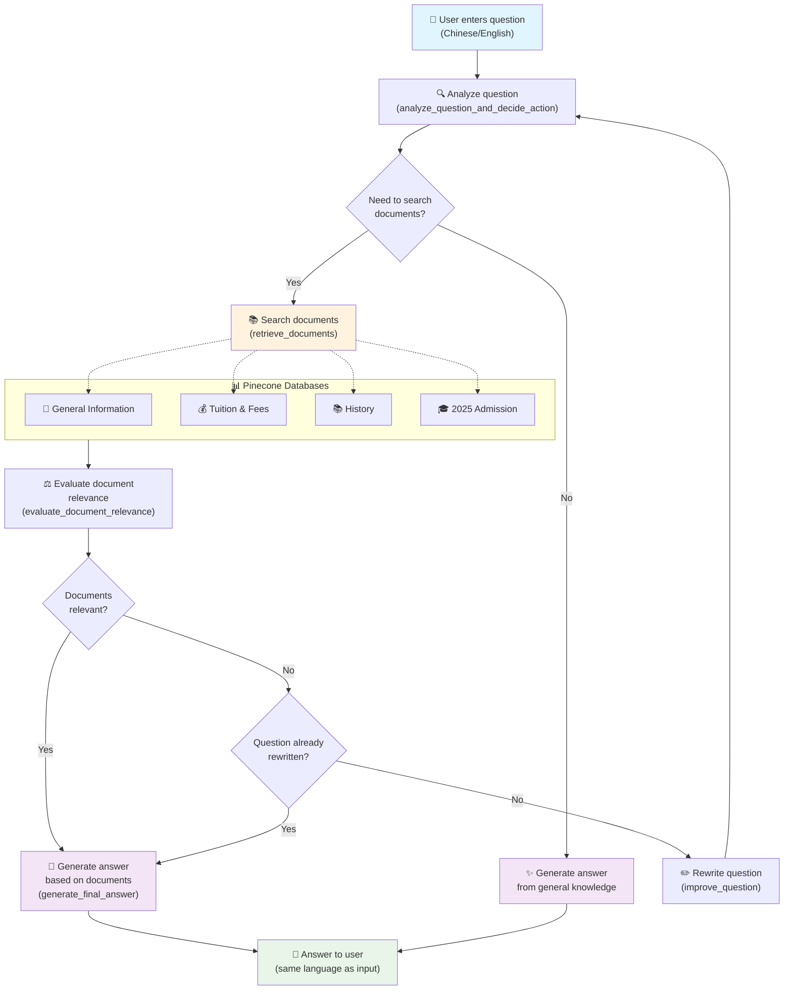

# 🎓 Guangxi Normal University Admission Chatbot

An intelligent admission counseling chatbot for Guangxi Normal University using RAG (Retrieval-Augmented Generation) and Streamlit, built with LangGraph workflow and powered by DeepSeek AI.

## 📖 Overview

This chatbot system uses advanced RAG architecture with LangGraph to provide accurate and up-to-date admission information. The bot can automatically search, evaluate, and synthesize information from specialized databases about Guangxi Normal University. It supports bilingual interaction (Chinese/English) with intelligent language detection.

## 🚀 Key Features

- **🤖 Intelligent RAG Workflow**: Built with LangGraph for smart processing flow
- **💬 Bilingual Chat Interface**: Modern and responsive Streamlit interface supporting Chinese/English
- **🔍 Smart Search**: Intelligent search across specialized databases
- **📚 Document Management**: Upload and manage .txt documents automatically
- **🎯 Smart Question Rewriting**: Automatically improve questions for better search results
- **⚡ Real-time Processing**: Process and answer questions in real-time
- **🧠 DeepSeek AI Powered**: Advanced reasoning capabilities with DeepSeek models
- **🌏 Language Intelligence**: Automatically detects and responds in the same language (Chinese/English)

## 🔄 Chatbot Workflow



### Step-by-Step Explanation:

1. **📝 Question Analysis**: DeepSeek AI analyzes the question and decides whether to search documents or answer directly
2. **🔍 Document Retrieval**: Uses retrieval tools to search across 4 specialized Pinecone databases
3. **⚖️ Document Evaluation**: Evaluates relevance of retrieved documents to the question
4. **✏️ Question Rewriting**: If documents are not relevant, automatically rewrites the question (max 1 time)
5. **💬 Answer Generation**: Generates final answer based on documents or general knowledge
6. **🌏 Language Detection**: Automatically responds in the same language as the input (Chinese/English)

## 🗃️ Database Structure

The system uses 4 specialized Pinecone indexes:

| Database | Description | Content |
|----------|-------------|---------|
| 🏫 `gxnu-general-information` | General Information | Campus facilities, academic programs, student life, and general university information |
| 💰 `gxnu-tuition-fees` | Tuition & Financial Info | Tuition costs, scholarships, financial aid, payment methods, and fee structures |
| 📚 `gxnu-history` | History & Heritage | Founding history, development milestones, achievements, notable alumni |
| 🎓 `gxnu-admission-2025` | 2025 Admission Info | Application procedures, admission requirements, deadlines, entrance exams |

## 📋 System Requirements

- **Python**: 3.8 or higher
- **API Keys**:
  - DeepSeek API Key (for LLM reasoning and generation)
  - OpenAI API Key (for embeddings)
  - Pinecone API Key (for vector storage)

## 🛠️ Installation Guide

### 1. Clone Repository
```bash
git clone <repository-url>
cd demo_reformat
```

### 2. Install Dependencies
```bash
pip install -r requirements.txt
```

### 3. Configure API Keys

Create `.streamlit/secrets.toml` file and fill in your API keys:

```toml
DEEPSEEK_API_KEY = "your_deepseek_api_key"
OPENAI_API_KEY = "your_openai_api_key" 
PINECONE_API_KEY = "your_pinecone_api_key"
ENTER_KEY = "your_enter_key"
```

### 4. Run Application
```bash
streamlit run streamlit_app.py
```

Access: `http://localhost:8501`

## 💻 Usage Guide

### 🗣️ Chat with Bot

1. **Access the application** at `http://localhost:8501`
2. **Enter your question** in the chat box at the bottom (in Chinese or English)
3. **Receive answers** from the bot with accurate information from specialized databases

### 📄 Add New Documents

1. **Select appropriate database** in the sidebar
2. **Upload .txt file** (UTF-8 format)
3. **Click "Add Document"**
4. **Wait for processing** - documents will be automatically chunked and added to the vector database

### 💡 Sample Question Types

**Admission (English):**
- "What are the admission requirements for Guangxi Normal University 2025?"
- "What majors are available for 2025 admission?"
- "How do I apply for admission?"

**Admission (Chinese):**
- "广西师范大学2025年招生条件是什么？"
- "2025年有哪些专业招生？"
- "如何申请入学？"

**Financial (English):**
- "How much is the tuition fee at Guangxi Normal University?"
- "What scholarship opportunities are available?"
- "What are the estimated living costs?"

**Financial (Chinese):**
- "广西师范大学的学费是多少？"
- "有什么奖学金机会？"
- "预估生活费用是多少？"

**General Information (English):**
- "What academic programs does Guangxi Normal University offer?"
- "What are the campus facilities like?"
- "Tell me about the faculty qualifications?"

**History (Chinese):**
- "广西师范大学的历史发展是怎样的？"
- "学校历史上的重要里程碑有哪些？"

## 🏗️ System Architecture

```
├── agent/                      # Core RAG Logic
│   ├── graph.py               # LangGraph workflow definition
│   ├── prompts.py             # DeepSeek AI prompts for different tasks
│   └── vectorstore.py         # Pinecone vector store management
├── config/                     # Configuration
│   ├── CONFIG.py              # System configuration (DeepSeek + OpenAI)
│   └── pinecone_indexes.json  # 4 specialized database configurations
├── utils/                      # Utilities
│   └── log.py                 # Logging system
├── static/                     # Static assets
│   └── logo.png               # University logo
├── data/                       # Sample data
├── scripts/                    # Utility scripts
├── streamlit_app.py           # Main Streamlit application (bilingual)
├── requirements.txt           # Python dependencies
└── README.md                  # Documentation
```

### 🧩 Key Components

**📊 Agent Module:**
- `graph.py`: LangGraph workflow definition with nodes and edges for DeepSeek AI
- `vectorstore.py`: Manages connections and operations with 4 Pinecone databases
- `prompts.py`: English prompt templates for evaluation, rewriting, generation with bilingual response capability

**⚙️ Config Module:**
- `CONFIG.py`: Configuration for DeepSeek API, OpenAI embeddings, models, and parameters
- `pinecone_indexes.json`: Defines 4 specialized databases for different information types

**🖥️ Frontend:**
- `streamlit_app.py`: Bilingual chat interface and document management (Chinese/English)

## 🔧 Customization and Extension

### Adding New Database

1. **Update** `config/pinecone_indexes.json` (currently has 4 specialized databases):
```json
{
  "name": "your-new-index-name",
  "description": "Tool description for DeepSeek AI selection",
  "description_for_human": "Human readable description"
}
```

2. **Restart** application to load new configuration

### Customizing Workflow

Edit `agent/graph.py` to:
- Add new nodes in the workflow
- Change routing logic
- Update evaluation criteria for DeepSeek AI

### Customizing Prompts

Edit `agent/prompts.py` to:
- Improve prompts for document evaluation
- Customize answer style and tone
- Add context instructions for bilingual responses
- Modify language detection logic

## 🐛 Troubleshooting

### Common Issues

**❌ API Key Error:**
```
ValueError: Required API key not found
```
**🔧 Solution:** Check `.streamlit/secrets.toml` file and ensure all API keys are correct (DeepSeek, OpenAI, Pinecone)

**❌ DeepSeek Connection Error:**
```
Error connecting to DeepSeek API
```
**🔧 Solution:** Verify DeepSeek API key and check internet connection

**❌ Pinecone Connection Error:**
```
Error initializing Pinecone client
```
**🔧 Solution:** Check Pinecone API key and internet connection

**❌ File Upload Error:**
```
Error loading document
```
**🔧 Solution:** Ensure .txt file uses UTF-8 encoding

**❌ Language Detection Issues:**
```
Responses in wrong language
```
**🔧 Solution:** Check prompt formatting and ensure clear language indicators in questions

### Debug Steps

1. **Check logs** in terminal for detailed error messages
2. **Verify API keys** in secrets.toml (DeepSeek, OpenAI, Pinecone)
3. **Test connections** to DeepSeek, OpenAI, and Pinecone
4. **Check file format** (.txt files with UTF-8 encoding)
5. **Validate database** configurations in pinecone_indexes.json

## 📊 Performance Notes

- **Response Time**: 2-5 seconds depending on question complexity (DeepSeek AI processing)
- **Document Processing**: ~1-2 seconds per document chunk
- **Concurrent Users**: Suitable for 10-50 simultaneous users
- **Vector Search**: Sub-second response time across 4 specialized databases
- **Language Processing**: Near-instant language detection and switching
- **Bilingual Support**: Seamless Chinese/English conversation handling

## 🤝 Contributing

To contribute to this project:

1. Fork the repository
2. Create a feature branch
3. Commit your changes
4. Push and create a Pull Request

## 📞 Support

If you encounter issues, please check:

✅ **API Keys**: Ensure DeepSeek, OpenAI, and Pinecone keys are valid with sufficient quota  
✅ **Dependencies**: Install all packages from requirements.txt including langchain-deepseek  
✅ **Network**: Stable internet connection for API calls  
✅ **File Format**: Only upload .txt files with UTF-8 encoding  
✅ **Python Version**: Python 3.8+ recommended  
✅ **Database Config**: Verify 4 databases are properly configured in pinecone_indexes.json  

## 🎯 Key Improvements

This version includes several enhancements:

- **🧠 Advanced AI**: Powered by DeepSeek for better reasoning capabilities
- **🌍 Bilingual Support**: Intelligent Chinese/English language detection and response
- **📚 Specialized Databases**: 4 focused databases for better information retrieval
- **🎓 University Focus**: Specifically designed for Guangxi Normal University admission counseling
- **⚡ Improved Performance**: Optimized workflow for faster response times

---

**Made with ❤️ for Guangxi Normal University Admissions**

*Version: 2.0.0 | Updated: 2025* 